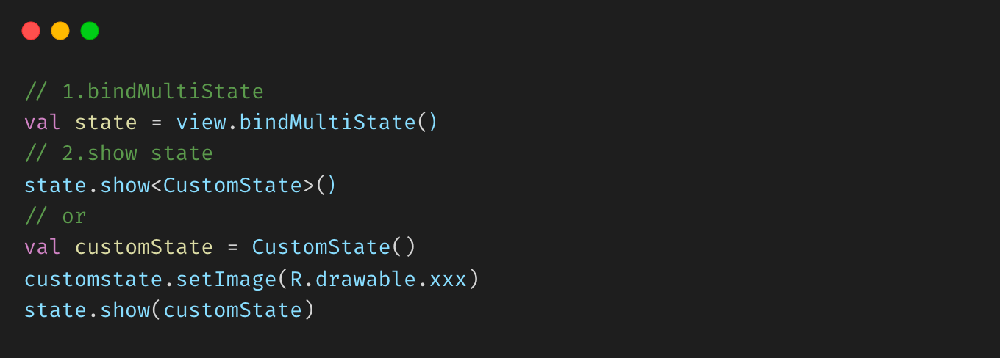

# MultiStatePage

[](https://jitpack.io/#Zhao-Yan-Yan/MultiStatePage) [](https://github.com/Zhao-Yan-Yan/MultiStatePage/blob/master/LICENSE) 



| [Activity](app/src/main/java/com/zy/demo/MultiStateActivity.kt) | [Fragment](app/src/main/java/com/zy/demo/MultiFragmentActivity.kt) | [View](app/src/main/java/com/zy/demo/MultiViewActivity.kt) | [ViewPager2](app/src/main/java/com/zy/demo/ViewPager2Activity.kt) |
|:---------------------------------------------------------------:|:------------------------------------------------------------------:|:----------------------------------------------------------:|:-----------------------------------------------------------------:|
|                               |                                  |                                  |                             |

| [Lottie拓展（自定义State）](app/src/main/java/com/zy/demo/LottieExtActivity.kt) | [State刷新](app/src/main/java/com/zy/demo/RefreshStateActivity.kt) | [网络请求](app/src/main/java/com/zy/demo/MockNetActivity.kt) | [sample](app/src/main/java/com/zy/demo/ApiActivity.kt) |
|:------------------------------------------------------------------------:|:----------------------------------------------------------------:|:--------------------------------------------------------:|:------------------------------------------------------:|
|                                            |                                   |                                  |                                |

## MultiStatePage的功能及特点

- 无需在布局添加视图代码
- 可显示自定义状态视图,任意拓展
- 可用于 Activity、Fragment、或指定的 View
- 自定义重新请求监听
- 支持xml直接嵌套且不限制要展示状态内容
- 可动态更新视图样式
- 可结合第三方控件使用
- 支持状态回调监听
- kotlin开发更易用的API

## 开始

### 添加依赖

Step1. Add the JitPack repository to your build file

```
allprojects {
    repositories {
        maven { url 'https://jitpack.io' }
    }
}
```

Step2. Add the dependency [](https://jitpack.io/#Zhao-Yan-Yan/MultiStatePage)

```
dependencies {
    implementation 'com.github.Zhao-Yan-Yan:MultiStatePage:2.0.6'
}
```

### 1.生成MultiStateContainer

#### 在View上使用

```kotlin
val multiStateContainer = MultiStatePage.bindMultiState(view)
// 或
val multiStateContainer = view.bindMultiState()
```

#### 在Activity根View中使用

```kotlin
val multiStateContainer = MultiStatePage.bindMultiState(this)
// 或
val multiStateContainer = bindMultiState()
```

#### 在Fragment根View中使用

```kotlin
class MultiStateFragment : Fragment {

    private lateinit var multiStateContainer: MultiStateContainer

    override fun onCreateView(inflater: LayoutInflater, container: ViewGroup?, savedInstanceState: Bundle?): View? {
        val root = inflater.inflate(R.layout.fragment, container, false)
        multiStateContainer = MultiStatePage.bindMultiState(root)
        // 或
        multiStateContainer = root.bindMultiState()
        return multiStateContainer
    }
}
```

#### xml中引用

```xml

<com.zy.multistatepage.MultiStateContainer 
    android:id="@+id/container" 
    android:layout_width="match_parent" 
    android:layout_height="match_parent">

    <androidx.recyclerview.widget.RecyclerView
        android:id="@+id/recycler_view" 
        android:layout_width="match_parent"
        android:layout_height="match_parent" />

</com.zy.multistatepage.MultiStateContainer>
```

### 2.切换状态

```kotlin
multiStateContainer.show<CustomState>()
// 或
multiStateContainer.show(CustomState())
```

#### 更新state信息

```kotlin
multiStateContainer.show<ErrorState> { errorState ->
    errorState.setErrorMsg("xxx出错了")
}
```

### 如何添加重试事件（建议自定义State实现）参考 ErrorState

```kotlin
class ErrorState : MultiState() {

    private lateinit var tvRetry: TextView

    private var retry: OnRetryClickListener? = null

    override fun onCreateView(
        context: Context, inflater: LayoutInflater, container: MultiStateContainer
    ): View {
        return inflater.inflate(R.layout.mult_state_error, container, false)
    }

    override fun onViewCreated(view: View) {
        tvRetry = view.findViewById(R.id.tv_retry)
        tvRetry.setOnClickListener { retry?.retry() }
    }

    fun retry(retry: OnRetryClickListener) {
        this.retry = retry
    }

    fun interface OnRetryClickListener {
        fun retry()
    }
}
```

```kotlin
multiStateContainer.show<ErrorState> { state ->
    state.retry { do () }
}
// 或
val state = ErrorState().apply {
    retry { do () }
}
multiStateContainer.show(state)
```

### 如何设置默认State

利用kotlin拓展函数可以很轻松的实现

```kotlin
val multiStateActivityRoot = bindMultiState().apply { showEmpty() }
```

### 自定义State

#### 继承`MultiState`

```kotlin
class LottieWaitingState : MultiState() {
    override fun onCreateView(context: Context, inflater: LayoutInflater, container: MultiStateContainer): View {
        // your state view
        return inflater.inflate(R.layout.multi_lottie_waiting, container, false)
    }

    override fun onViewCreated(view: View) {
        //逻辑处理
    }

    override fun onHiddenChanged(hide: Boolean) {
        if (hide) {
            // State 隐藏
        } else {
            // State 显示
        }
    }
}
```

结合`ViewBidng` 参考 `demo` [MultiStateBinding](app/src/main/java/com/zy/demo/base/MultiStateBinding.kt) 和 [WithBindingState](app/src/main/java/com/zy/demo/state/WithBindingState.kt)

### 使用内置状态配置

**默认内置3种状态（强烈建议您自定义State）**

```kotlin
val multiStateContainer = MultiStatePage.bindMultiState(view)
//成功页 
multiStateContainer.show<SuccessState>()
//错误页
multiStateContainer.show<ErrorState>()
//空页面
multiStateContainer.show<EmptyState>()
//加载状态页
multiStateContainer.show<LoadingState>()
```

**更换默认资源**

```kotlin
class App : Application() {
    override fun onCreate() {
        super.onCreate()
        val config = MultiStateConfig.Builder()
            .alphaDuration(300)
            .errorIcon(R.mipmap.state_error)
            .emptyIcon(R.mipmap.state_empty)
            .emptyMsg("emptyMsg")
            .loadingMsg("loadingMsg")
            .errorMsg("errorMsg")
            .build()
        MultiStatePage.config(config)
    }
}
```

|    Methods    |   Description   |
|:-------------:|:---------------:|
| alphaDuration |    alpha动画时长    |
|   errorIcon   |    错误状态默认图标     |
|   emptyIcon   |    空数据状态默认图标    |
|   emptyMsg    |   空数据状态默认提示信息   |
|   errorMsg    |   错误状态默认提示信息    |
|  loadingMsg   | loading状态默认提示信息 |

### 小技巧

可以借助kotlin的拓展函数封装常用的状态

```kotlin
fun MultiStateContainer.showSuccess(callBack: (SuccessState) -> Unit = {}) {
    show<SuccessState> { callBack.invoke(it) }
}

fun MultiStateContainer.showError(callBack: (ErrorState) -> Unit = {}) {
    show<ErrorState> { callBack.invoke(it) }
}

fun MultiStateContainer.showEmpty(callBack: (EmptyState) -> Unit = {}) {
    show<EmptyState> { callBack.invoke(it) }
}

fun MultiStateContainer.showLoading(callBack: (LoadingState) -> Unit = {}) {
    show<LoadingState> { callBack.invoke(it) }
}
```

```kotlin
val multiStateContainer = bindMultiState()
multiStateContainer.showLoading()
multiStateContainer.showSuccess()
```

## 下载Demo

点击或者扫描二维码下载

[](https://www.pgyer.com/PVAi)

## Thanks

- [DylanCaiCoding/LoadingHelper](https://github.com/DylanCaiCoding/LoadingHelper/)
- [KingJA/LoadSir](https://github.com/KingJA/LoadSir)
- [airbnb/lottie-android](https://github.com/airbnb/lottie-android)
- [lottie动画资源社区](https://lottiefiles.com/featured)
- [玩Android](https://www.wanandroid.com/)

## License

```
Copyright (C) 2020. ZhaoYan

Licensed under the Apache License, Version 2.0 (the "License");
you may not use this file except in compliance with the License.
You may obtain a copy of the License at

    http://www.apache.org/licenses/LICENSE-2.0

Unless required by applicable law or agreed to in writing, software
distributed under the License is distributed on an "AS IS" BASIS,
WITHOUT WARRANTIES OR CONDITIONS OF ANY KIND, either express or implied.
See the License for the specific language governing permissions and
limitations under the License.
```

